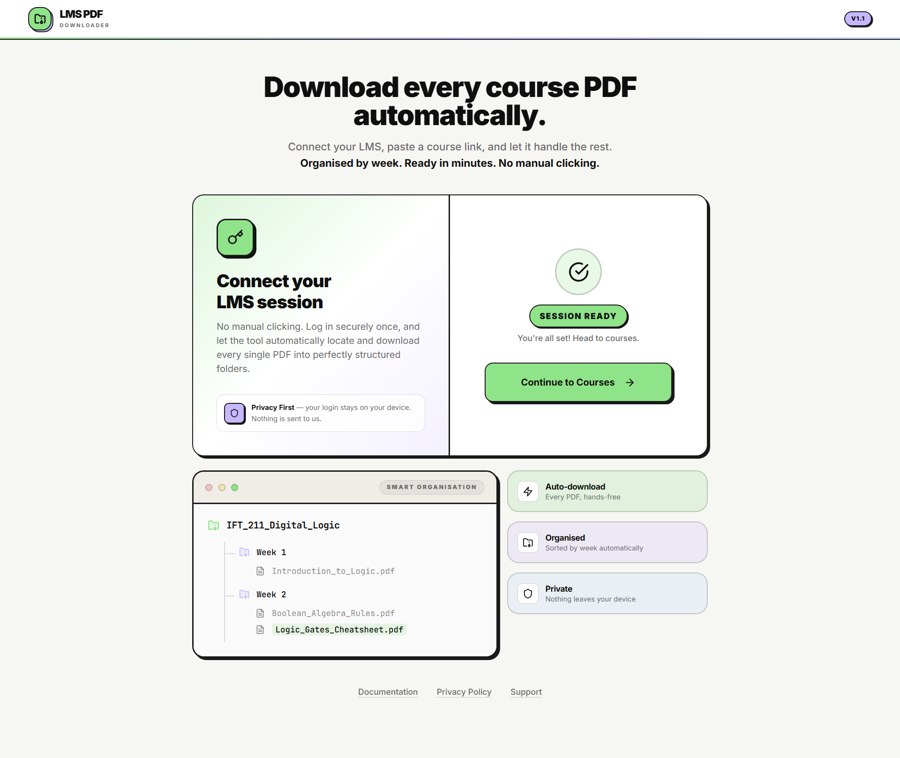
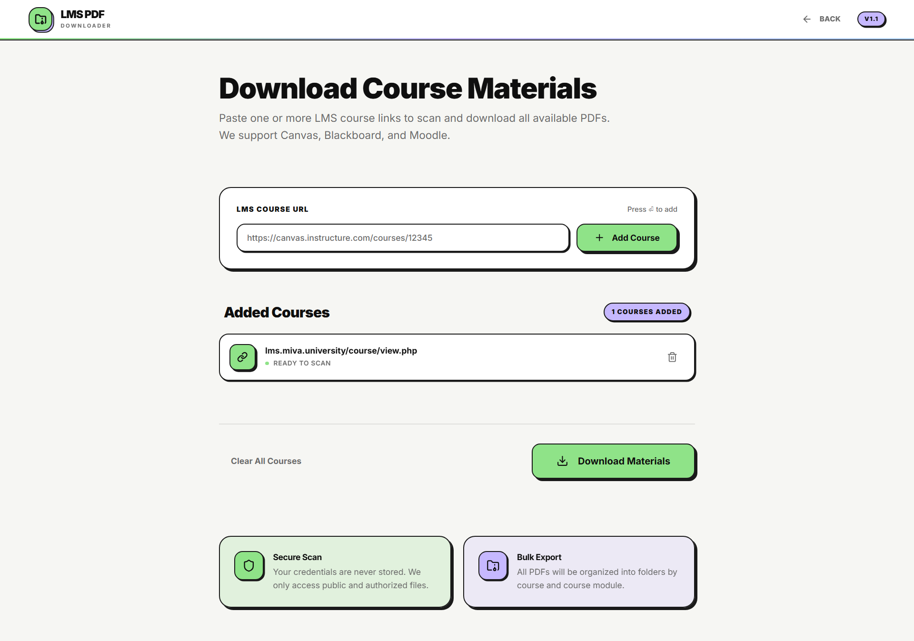
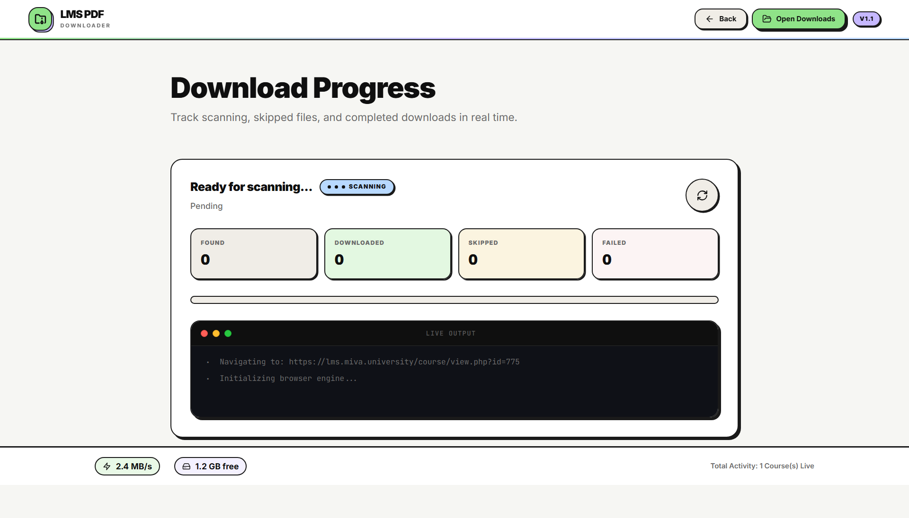
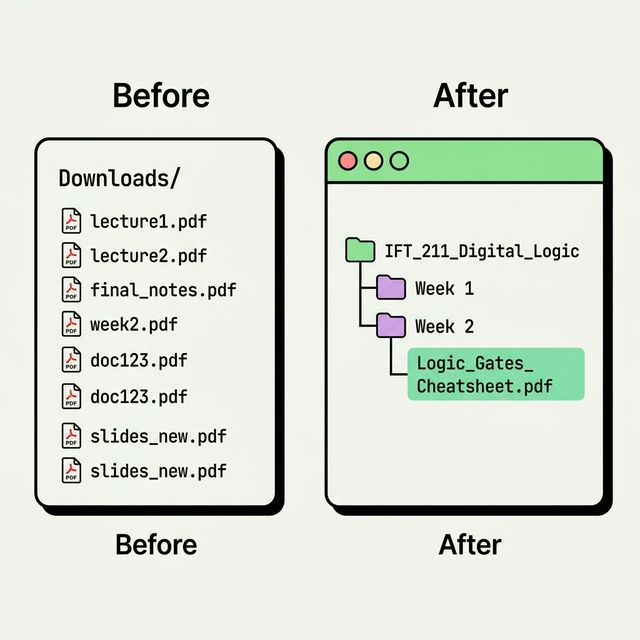

<div align="center">
  

  <h1>LMS PDF Downloader</h1>
  
  <p><strong>A beautifully automated, privacy-first tool to extract and organise course PDFs from your LMS.</strong></p>

  <p>
    <a href="https://github.com/Adeolu05/lms-pdf-downloader"></a>
    <a href="https://github.com/Adeolu05/lms-pdf-downloader/releases/latest"></a>
    <a href="https://nodejs.org/"></a>
    <a href="https://playwright.dev/"></a>
    <a href="./docs/design-system.md"></a>
    <a href="LICENSE"></a>
  </p>

  <p>
    <strong>
      <a href="https://github.com/Adeolu05/lms-pdf-downloader/releases/latest">Download the latest Windows setup (.exe) from GitHub Releases →</a>
    </strong><br />
    <small>Under <strong>Assets</strong>, choose <code>LMS PDF Downloader-*-Setup.exe</code>. The public website (e.g. Vercel) only hosts download instructions — run the app on your PC.</small>
  </p>

  <p align="center">
    <a href="https://github.com/Adeolu05/lms-pdf-downloader/releases/latest">Latest release</a>
    &nbsp;·&nbsp;
    <a href="https://github.com/Adeolu05/lms-pdf-downloader/releases">All releases</a>
    &nbsp;·&nbsp;
    <a href="https://github.com/Adeolu05/lms-pdf-downloader/issues">Report an issue</a>
  </p>
</div>

---

## 📥 Download (Windows)

1. Open **[Latest GitHub Release](https://github.com/Adeolu05/lms-pdf-downloader/releases/latest)**.
2. Under **Assets**, download **`LMS PDF Downloader-*-Setup.exe`**, run the installer, then open the app from the Start menu.
3. If **SmartScreen** appears, use **More info → Run anyway** (installer is not code-signed yet).

**From source (macOS / Linux / dev):** see [Quick start](#quick-start-local) below.

---

## 🎯 The Problem
As a student, you log into your Learning Management System (Canvas, Blackboard, Moodle), click into a course, navigate to a module, open a resource page, view the embedded PDF, and finally click "Download". Repeat this 40 times for all your lectures.

**LMS PDF Downloader automates the entire process.** Connect your session, paste a link, and watch as it recursively scans your courses, extracts the literal PDF files (bypassing the LMS wrappers), and downloads everything into perfectly structured folders local to your machine. 

## 🎬 See it in Action


### ✨ Stunning Web Interface

<p align="center">
  
</p>
<p align="center">
  
</p>
<p align="center">
  
</p>

## ✨ Signature Feature: Smart Organisation Preview

Before a single file is pulled, you get a clean, visual representation of what your hard drive is going to look like. No more dumping 50 loosely-named files like `lec_1_final_v2(1).pdf` into your Downloads folder.

<p align="center">
  
</p>

Everything is cleaned, sanitised, and sorted the exact moment it touches your disk.

## 🚀 Key Features

* **Premium Next.js Web Dashboard:** A delightful, interactive, dark-terminal-themed UI built with strict design principles. 
* **Privacy-First Operations:** Zero-knowledge architecture. You login on your own machine. We do not store your passwords. Your cookies stay local.
* **Direct PDF Extraction:** Intelligently bypasses embedded PDF iframes and middleman "click here to open" resource pages.
* **Resumable Batch Downloads:** Queue up 5 courses at once. If it crashes or you stop it, it perfectly resumes where it left off by skipping existing files.
* **Stringent Filename Sanitisation:** Prevents OS path length errors and removes hidden LMS accessibility garbage tags automatically.

---

## 🌐 Deployed website (e.g. Vercel) = download & docs hub

The public site is meant to help students **get the Windows installer** and read **terminal / clone** instructions. **LMS login and PDF downloads do not run in the browser on Vercel** (no Playwright, no disk for sessions). Routes like `/courses` and `/progress` redirect to the home page on Vercel so people are not sent into a broken flow.

**Local / installed app:** full dashboard, login, and downloads — follow the **Quick start** section below.

**Vercel builds:** **`vercel.json`** makes `npm ci` skip **Playwright** and **Electron** binary downloads. **`next.config.mjs`** only sets `output: 'standalone'` when **`VERCEL`** is unset, so **`npm run dist`** still works on your machine.

---

<a id="quick-start-local"></a>

## 🏃 Quick start (local — full app)

> **Only need Windows?** Use the **[installer from Releases](https://github.com/Adeolu05/lms-pdf-downloader/releases/latest)** instead — no Node.js or terminal required. The steps below are for running from source or using Electron in dev mode.

You need **[Node.js 18+](https://nodejs.org/)** on your computer.

### 1. Clone and install

```bash
git clone https://github.com/Adeolu05/lms-pdf-downloader.git
cd lms-pdf-downloader
npm install
```

### 2. Install Playwright’s browser (required for LMS login & downloads)

```bash
npx playwright install
```

To save time and disk, Chromium alone is enough:

```bash
npx playwright install chromium
```

### 3. Run the app

**Option A — browser**

```bash
npm run dev
```

Open **http://localhost:3000** in your browser.

**Option B — desktop window (Electron)**

Runs the same Next.js app inside an app window (no separate browser tab).

```bash
npm run electron:dev
```

For a **production build** inside the desktop shell (starts the **standalone** Next server automatically):

```bash
npm run electron:start
```

`electron:start` runs `next build`, copies static files into `.next/standalone`, then opens Electron. From a **source checkout**, the server is started with **`node`** — **Node.js must be on your `PATH`**. (The **packaged installer** does not require a separate Node install; it runs the server with Electron’s runtime.)

### 3b. Build a desktop installer (optional)

From a clone with dependencies installed, generate platform installers under **`release/`**:

```bash
npm run dist
```

This pipeline:

1. **`next build`** — produces a [standalone](https://nextjs.org/docs/app/building-your-application/deploying#self-hosting) server in `.next/standalone` (see `next.config.mjs`).
2. **`scripts/copy-standalone-assets.cjs`** — copies `.next/static` and `public` into the standalone folder (required for assets).
3. **`scripts/prepare-playwright-browsers.cjs`** — downloads **Chromium** into `./playwright-browsers` (large, **OS-specific**).
4. **`npm run icons:electron`** — rasterizes **`app/icon.svg`** → **`build/icon.png`** (512×512) for the **installer / taskbar / window** icon (electron-builder reads `build/icon.png` automatically).
5. **electron-builder** — packs the app; outputs e.g. **Windows NSIS** `.exe`, **macOS** `.dmg` / `.zip`, **Linux** AppImage.

**Ship one build per OS** (build the Windows installer on Windows, macOS artifacts on macOS, etc.).

**Faster check without an installer:** unpacked app only:

```bash
npm run dist:dir
```

Then run the executable inside `release/win-unpacked/` (or the folder for your platform).

**Windows packaging:** `npm run dist` / `dist:dir` set **`CSC_IDENTITY_AUTO_DISCOVERY=false`** so packaging does not require code-signing tooling (you get an **unsigned** installer). If you still hit **symlink / 7-Zip** errors, enable **Developer Mode** in Windows (Settings → System → For developers) or run from an environment that can create symlinks. Proper **Authenticode** signing is a separate follow-up.

**Installed app data:** the packaged app sets **`LMS_USER_DATA_DIR`** to your OS **Electron userData** folder so `sessions/` and `downloads/` stay **writable** outside `Program Files`. In dev, data stays in the project root as before. Nothing is sent to us.

**Windows (installed app):** PDFs and session files live under your user profile, for example:

`%APPDATA%\lms-pdf-downloader\downloads\<Course name>\<Week or General>\`

Example: `C:\Users\<You>\AppData\Roaming\lms-pdf-downloader\downloads\SEN 299 - SIWES I\General\`

**macOS (installed app):** typically `~/Library/Application Support/lms-pdf-downloader/`.

### 3c. Ship a release (publish the Windows installer)

Artifacts are **not** committed to git (`release/` is ignored). You build locally, then upload the file to GitHub.

1. **Version** — set `"version"` in `package.json` to match the release (e.g. `1.1.0`).
2. **Build** — on a Windows machine: `npm run dist`.
3. **Artifacts** — from `release/`, keep **`LMS PDF Downloader-<version>-Setup.exe`** (and optionally the `.blockmap` if you add auto-updates later). Do **not** commit the `release/` folder.
4. **Tag** — `git tag v1.1.0` then `git push origin v1.1.0` (use the same version as `package.json`).
5. **GitHub Release** — [Releases](https://github.com/Adeolu05/lms-pdf-downloader/releases) → **Draft a new release** → choose the tag → title e.g. `v1.1.0` → attach **`LMS PDF Downloader-1.1.0-Setup.exe`** → publish.

**Suggested release notes (copy/paste and edit):**

```markdown
## LMS PDF Downloader v1.1.0 — Windows (x64)

- Desktop app: install and run locally (no separate Node.js required).
- Login once in the embedded browser, then queue course URLs and download PDFs.
- Downloads and session data: `%APPDATA%\lms-pdf-downloader\` (Windows).

**Note:** This build is **not code-signed**. Microsoft SmartScreen may show a warning — use *More info* → *Run anyway* if you trust this release. Code signing can be added later for smoother installs.
```

Replace the repo link in step 5 if your fork or org URL differs.

### 3d. Ship another release (e.g. v1.1.1 after v1.1.0)

1. Merge your changes to **`main`** and pull locally.
2. Bump **`"version"`** in `package.json` (and the header badge in `components/layout/Header.tsx` if you show it).
3. **`npm run dist`** on the target OS (Windows → `.exe`).
4. Commit version bump, push **`main`**.
5. **`git tag v1.1.1`** (match the version) → **`git push origin v1.1.1`**.
6. GitHub → **Releases** → **Draft a new release** → choose that tag → attach the new **`LMS PDF Downloader-*-Setup.exe`** → publish.

Keep previous releases available; students may still be on an older installer.

### 4. Use the dashboard

1. Click **Login to LMS**. A Chromium window opens — sign in to your LMS as usual.
2. Back in the web (or Electron) UI, click **Confirm Login Ready** to save your **local** session under `sessions/`.
3. On **Courses**, paste course URLs and click **Download Materials**.
4. PDFs are written under **`downloads/`** (project folder when developing from source, or **`%APPDATA%\lms-pdf-downloader\downloads\`** when using the installed Windows app), organised by course and week (see `core/config.ts` for LMS-specific behaviour).

---

## 💻 CLI / automation notes

The automation engine lives in **`core/`** and is used by the Next.js **API routes** when you run the app locally. The `npm run core:login` / `core:start` scripts load those modules but **do not yet ship a full CLI** with arguments; extend `core/session-manager.ts` / `core/downloader.ts` or call the same APIs from your own script if you need headless automation outside the UI.

---

## 🛠 Tech Stack

* **Frontend:** Next.js 14 (App Router), React, Tailwind CSS, Lucide Icons.
* **Automation:** Node.js, Playwright.
* **Architecture:** Tightly decoupled `/core` (Node) and `/app` (React) allowing the UI to interact purely through Next.js API routes.

## 📁 Repository Structure

```text
lms-pdf-downloader/
├── app/                # Next.js App Router (Frontend Pages & API)
├── components/         # Reusable React UI (features/, layout/, ui/)
├── core/               # Automation Engine (Playwright scripts)
├── electron/           # Electron shell (desktop window + local Next server)
├── lib/                # Shared utilities, React Context, Design Tokens
├── scripts/            # Standalone asset copy + Playwright bundle for packaging
├── docs/               # Project documentation & Architecture
├── assets/             # Media assets for marketing/README
├── next.config.mjs     # Next config (output: standalone for desktop installers)
├── electron-builder.yml # electron-builder packaging (see npm run dist)
├── build/              # build/icon.png — generated from app/icon.svg for Electron (commit after change)
├── downloads/          # Local output directory for PDFs (gitignored)
├── sessions/           # Local Auth State storage (gitignored)
├── playwright-browsers/  # Chromium cache used when building installers (gitignored)
└── release/            # Built installers / unpacked app (gitignored)
```

## 🎨 Design System

We take our aesthetics seriously. This project implements a formal `docs/design-system.md` adhering to a strict 2px-border, hard-shadow Neo-brutalist (yet warm) interaction language. See `lib/design-tokens.ts` for the exact metrics.

## 🛣 Roadmap

- [x] Persistent login session state
- [x] Intelligent direct PDF extraction
- [x] Resumable queue architecture
- [x] Beautiful Next.js User Interface
- [x] Smart Organisation / Batch Course Support
- [ ] Export to Notion / Google Drive integration
- [x] Desktop shell (Electron: `npm run electron:dev` / `electron:start`)
- [x] Desktop installers (`npm run dist`) with bundled Chromium for Playwright (unsigned by default)
- [ ] Code-signed / notarized installers for distribution

## 🤝 Contributing

We welcome contributions! The separation of concerns makes this codebase highly approachable. 
* To tweak the frontend, stick to `/app` and `/components`. 
* To fix an LMS scraping bug when Moodle updates their DOM, stick to `/core/downloader.ts` and `core/config.ts`.

Please read our `docs/architecture.md` before submitting major Pull Requests.

## 📜 License

[MIT License](LICENSE)

## 👤 Author

Built by **David Peluola**

