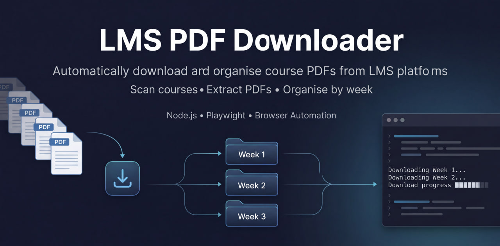

# LMS PDF Downloader

<p align="center">
  
</p>

<h1 align="center">LMS PDF Downloader</h1>

<p align="center">
Automate downloading and organising course PDFs from LMS platforms
</p>


Automates downloading PDF course materials from Learning Management Systems (LMS) by scanning course pages and organizing files by week.

This tool now features a **premium, interactive web interface** built with Next.js and Tailwind CSS, providing a delightful and secure experience for students to extract course materials. It uses Playwright automation under the hood to log into an LMS session, detect course materials labelled **(PDF)**, and download them automatically into structured folders.

Perfect for students who want to quickly collect and organise all lecture materials from their LMS without downloading files one by one.

---

## Demo


---

## Features

- **Modern Premium Web UI ✨ (New!)**  
  A stunning, responsive dashboard with micro-interactions, dark-themed live terminal logs, auto-generated avatars, and an interactive download progress tracker.

- **Privacy First 🛡️**  
  Your credentials are never stored. The app relies strictly on your local browser session and cookies to securely access authorized files on your behalf. Read more on our dedicated `Privacy Policy` page.

- **Resumable & Batch downloads**  
  Queue multiple courses at once. Automatically skips files that already exist, so you can safely rerun the downloader anytime.

- **Direct PDF extraction**  
  Bypasses LMS PDF viewers by extracting the real PDF source from iframes or resource links.

- **Handles multiple resource types**  
  Supports:
  - direct PDF pages
  - embedded PDF viewers
  - intermediate “click to open resource” pages

- **Week-based organisation**  
  Downloaded files are sorted into folders like `Week 1`, `Week 2`, and so on.

- **Filename sanitisation**  
  Cleans illegal Windows filename characters and removes hidden LMS accessibility text.

- **Persistent login session**  
  Uses a saved local browser session so you only need to log in once.

---

## Example Output

```text
downloads/
└── IFT_211_Digital_Logic_Design
    ├── Week 1
    │   └── Week 1 - Information Representation And Number Base Systems.pdf
    ├── Week 2
    │   └── Week 2 - Boolean Algebra And Logic Gates.pdf
    ├── Week 3
    │   └── Week 3 - Minimisation Techniques.pdf
```

---

## Prerequisites

Make sure the following are installed:

* [Node.js](https://nodejs.org)
* Playwright Chromium browser

Install dependencies:

```bash
npm install
npx playwright install chromium
```

---

## How It Works

The downloader can now be used via the **Web Interface** or the **CLI**.

### Web Interface (Recommended)

1. **Start the App:**
   ```bash
   npm run dev
   ```
2. **Open your browser:** Navigate to `http://localhost:3000`
3. **Connect Session:** Click "Login to LMS" to securely authenticate and save your session.
4. **Queue Courses:** Paste your LMS course links into the dashboard.
5. **Download:** Watch the terminal logs and striped progress bars as your files are downloaded and organised.

---

### CLI Version (Legacy)

The downloader works in **two simple steps**.

### Step 1 — Login and Save Session

This captures your authenticated browser session so you do not need to log in every time.

Run:

```bash
npm run login
```

Or target a specific course page directly:

```bash
node src/session-manager.js "https://lms.miva.university/course/view.php?id=336"
```

### What happens

1. A browser window opens
2. Log into your LMS manually
3. Return to the terminal
4. Press **ENTER** to save the session

If successful, your session will be saved locally in:

```text
sessions/storageState.json
```

---

### Step 2 — Download Course Materials

Run the downloader with the course URL:

```bash
node src/downloader.js "https://lms.miva.university/course/view.php?id=336"
```

The downloader will:

1. scan the course page
2. detect items labelled **(PDF)**
3. extract the real PDF source
4. download the files
5. organise them by week

If a file already exists, it is skipped automatically.

---

## Configuration

All selectors, delays, and settings are managed in:

```text
src/config.js
```

If the LMS layout changes, update the selectors there.

---

## Project Structure

```text
lms-pdf-downloader
│
├── assets
│   ├── banner.jpg
│   └── demo.gif
│
├── src
│   ├── downloader.js
│   ├── session-manager.js
│   └── config.js
│
├── sessions
│   └── storageState.json
│
├── downloads
│
├── package.json
├── package-lock.json
└── README.md
```

---

## Notes

* This tool does **not** store your password
* Login is done manually through the browser
* Authentication cookies are stored **locally on your machine only**
* `sessions/`, `downloads/`, and `node_modules/` should remain in `.gitignore`

---

## Roadmap

* [x] Persistent login session
* [x] Direct PDF extraction
* [x] Intermediate resource-page handling
* [x] Resumable downloads
* [x] Frontend UI for non-technical users (Next.js + Tailwind CSS)
* [x] Batch course downloads
* [ ] Desktop app version

---

## License

MIT License

---

## Author

**David Peluola**
